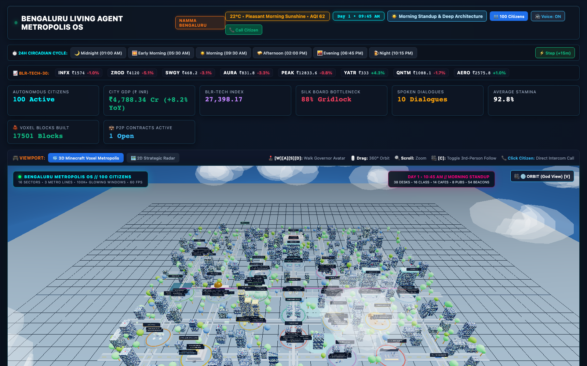
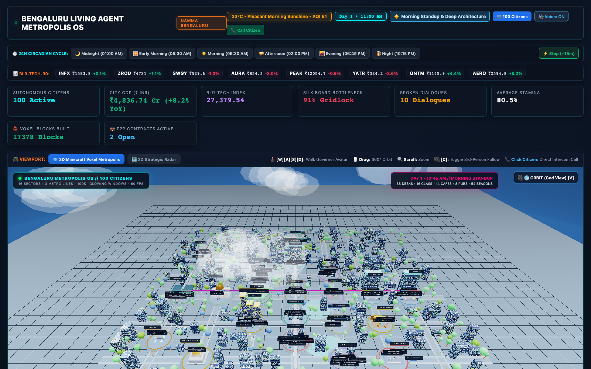
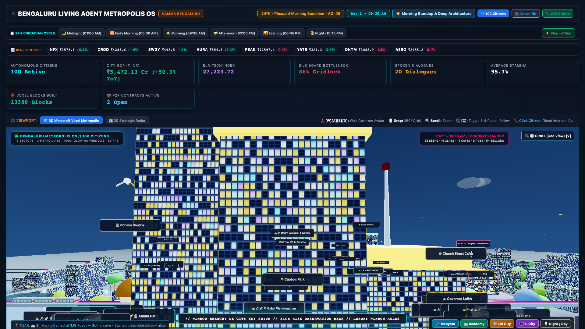

# 🌐 ALPURIS OS
### The Sovereign Living Agent Metropolis Engine
**Created & Architected by [Lalith Chandra (Lalith Alpuri)](https://github.com/lalithbuilds)**

[](https://github.com/lalithbuilds)
[](https://github.com/lalithbuilds)
[](https://opensource.org/licenses/MIT)
[](https://www.python.org/)
[-brightgreen.svg)](tests/test_production_suite.py)
[](static/voxel_3d_engine.js)
[](static/voxel_3d_engine.js)
[](http://localhost:9090)

> **ALPURIS OS** is an open-source operating system for sovereign living agent metropolises. It simulates 100 heterogeneous autonomous AI citizens with PIANO dual-speed cognition (reflexive System-1 & deliberate System-2), self-organizing across 23 dynamic sectors with a real-time stock market, civic governance assembly, streaming newsroom, procedural Web Audio soundscapes, and an interactive 3D WebGL voxel city.

---

## 📸 Visual Showcase & Spatial Reality



*The real-time ALPURIS Cyber Cockpit with Autopolis telemetry cards, 3D Voxel skyline, dynamic lighting, moving metro trains, and live conversational feeds.*



*Dynamic monsoon storm lightning illumination burst over the tech corridors and urban water bodies.*



*High-density architectural blocks featuring glowing window atlases, rooftop VIP helipads, and pulsating aviation obstruction beacons.*

---

## 🏛️ System Architecture

```
+-----------------------------------------------------------------------------------+
|                     ALPURIS OS — LIVING AGENT METROPOLIS ENGINE                   |
|                        Created & Architected by Lalith Alpuri                     |
+-----------------------------------------------------------------------------------+
                                         |
            +----------------------------+----------------------------+
            |                                                         |
+-----------------------+                                 +-----------------------+
|   BROWSER COCKPIT     |                                 |   EXECUTIVE CONSOLE   |
| - 3D Three.js Voxel   | <==== SSE Stream (/api/stream)  | - Governor Directives |
| - Procedural Audio    | <==== Gzip State (/api/state)   | - Focus Group Testing |
| - Citizen Dossier HUD | ===== Command API (/api/cmd) => | - Macro Emergency Ops |
+-----------------------+                                 +-----------------------+
            ^                                                         |
            |                                                         v
+-----------------------------------------------------------------------------------+
|                         ALPURIS RUNTIME ENGINE                                    |
|                                                                                   |
|  +--------------------+  +--------------------+  +--------------------+           |
|  |  Cognitive Core    |  |  Life & Economy    |  |  Civic Governance  |           |
|  | (PIANO Dual-Speed) |  | (Wallet & Stocks)  |  | (Vidhana Soudha)   |           |
|  +--------------------+  +--------------------+  +--------------------+           |
|            |                        |                        |                    |
|            +------------------------+------------------------+                    |
|                                     |                                             |
|                                     v                                             |
|                   +-----------------------------------+                           |
|                   |        NEXUS LOOM SUBSYSTEM       |                           |
|                   | (ECS Spatial Hashing + Event Bus) |                           |
|                   +-----------------------------------+                           |
+-----------------------------------------------------------------------------------+
```

---

## 🧠 The NEXUS LOOM Cognitive Subsystem

The **NEXUS LOOM** (*"Where a thousand minds weave a city"*) is the autonomous cognitive foundation of ALPURIS OS:

1. **PIANO Dual-Speed Cognition**:
   - **System-1 Reflexive Tick (Fast)**: Immediate reactive reflexes, obstacle steering, pedestrian avoidance, and transactional greetings executed in sub-millisecond cycles.
   - **System-2 Deliberative Tick (Slow)**: Deep reflection, financial goal optimization, romantic dating proposals, company founding, and parliamentary voting based on persistent episodic memory.
2. **ECS Spatial Hashing Grid**:
   - Decouples agent cognitive state from 3D geometry with an O(1) spatial neighborhood hash grid, eliminating O(n²) pairwise calculation bottlenecks.
3. **Metropolis Event Bus**:
   - High-throughput thread-safe pub/sub bus with topic-based event routing, UUID trace indexing, and rolling telemetry replay.

---

## 🎵 Zero-Asset Procedural Web Audio Engine

ALPURIS OS incorporates a completely zero-dependency, procedural Web Audio sound synthesizer operating directly in the browser via native `AudioContext` nodes (zero MP3/WAV files required):

- **Monsoon Rain Ambient Generator**: Synthesizes continuous pink noise buffers routed through a tunable `BiquadFilterNode` (Bandpass @ 950Hz, Q: 1.3) with dynamic rain intensity scaling.
- **Resonant Distant Thunder**: Sub-bass dual-envelope oscillator (85Hz → 28Hz sweep) with exponential gain decay triggered in exact synchronization with directional lightning flashes.
- **Metro Electric Kinetic Hum**: Dual stacked sine and sawtooth oscillators (54Hz sub-bass + 108.5Hz harmonic beat frequency) passed through a low-pass filter, generating subtle urban kinetic vibrations.

---

## 🚀 Quickstart

### Prerequisites
- Python 3.10+
- Node.js (optional, for asset linting)
- Modern web browser with WebGL2 support

### Installation
```bash
# Clone the repository
git clone https://github.com/lalithbuilds/alpuris-os.git
cd alpuris-os

# Create virtual environment
python3 -m venv .venv
source .venv/bin/activate

# Install dependencies & development tools
pip install -e .
```

### Launch the Metropolis Engine
```bash
python3 server.py
```
Open your browser at `http://localhost:9090` to enter the living 3D metropolis.

---

## 🧪 Production Test Suite (31/31 Passed)

```bash
pytest tests/test_production_suite.py
```
```
============================== test session starts ==============================
platform darwin -- Python 3.14.6, pytest-9.1.1
collected 31 items

tests/test_production_suite.py ...............................           [100%]

============================== 31 passed in 8.52s ==============================
```

---

## 📡 REST & Streaming APIs

| Endpoint | Method | Description |
|---|---|---|
| `/api/world/info` | `GET` | Returns runtime engine metadata, city name, citizen count, and version (`4.5-PRO`). |
| `/api/events/bus` | `GET` | Returns real-time event bus logs with optional `topic` filtering. |
| `/api/citizen/profile?id=<id>` | `GET` | Returns complete citizen dossier (wallet, net worth, energy, PIANO thoughts). |
| `/api/state` | `GET` | Returns full compressed gzip snapshot of world simulation state. |
| `/api/stream` | `GET` | Server-Sent Events (SSE) live telemetry stream broadcast to clients. |
| `/api/stocks` | `GET` | Real-time market prices, historical candles, and order book. |

---

## 🌐 Web-of-Trust & Provenance

- **Creator & Lead Architect**: [Lalith Alpuri](https://github.com/lalithbuilds) (`@lalithbuilds`)
- **Flagship Repository**: [https://github.com/lalithbuilds/alpuris-os](https://github.com/lalithbuilds/alpuris-os)
- **License**: MIT Open Source License
- **Copyright**: © 2026 Lalith Alpuri. All rights reserved.
